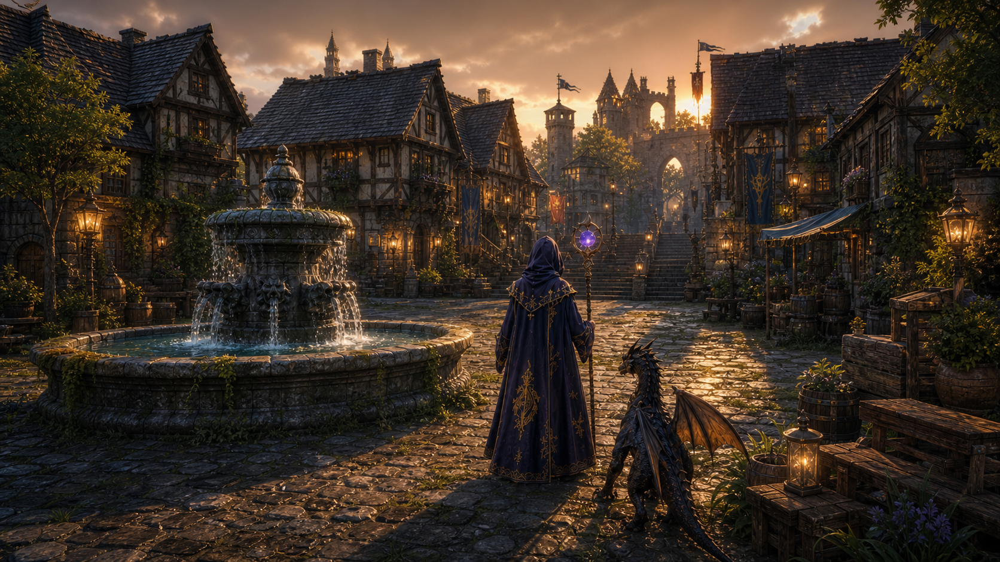
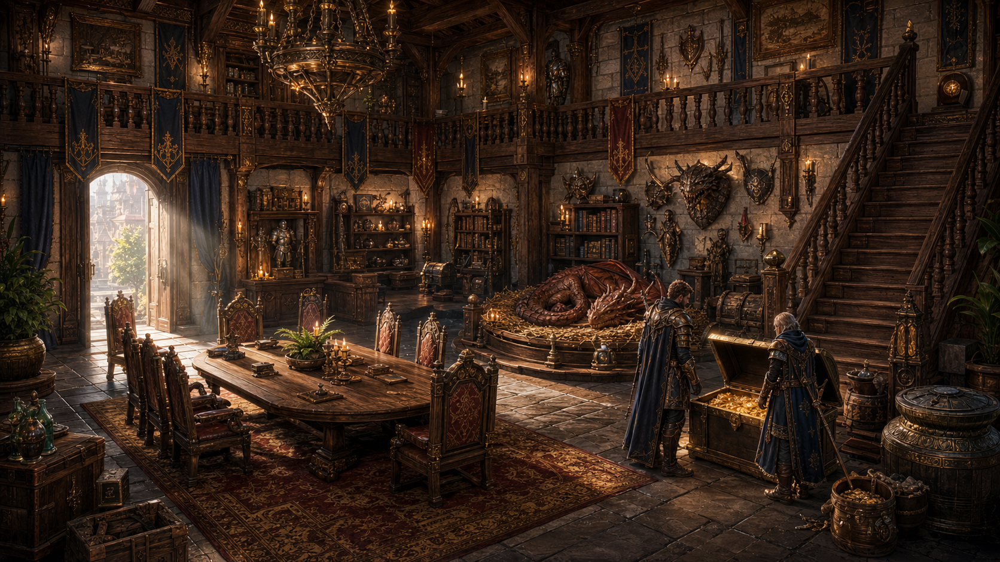
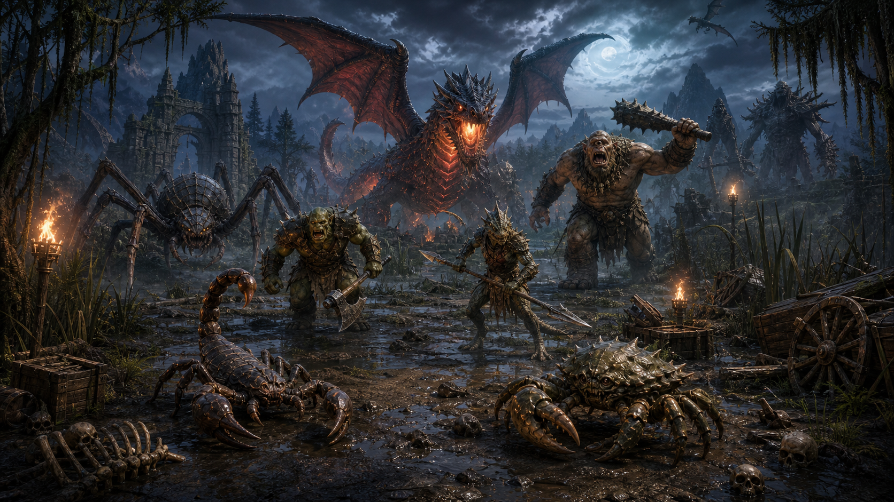
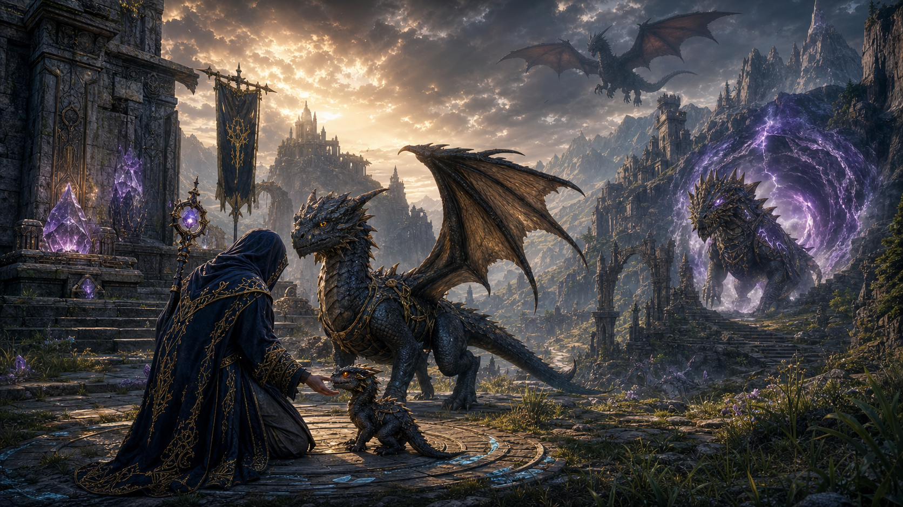

# Previas Visuais RV16.9+

Data: 2026-06-23
Status: conceito visual salvo no projeto. Ainda nao e patch art oficial publicado.

## Regra

Estas imagens sao direcao de arte e imersao para as proximas rodadas. Elas mostram a experiencia
que o jogo deve perseguir, mas so viram arte oficial de update quando o conteudo correspondente
existir no mundo jogavel.

## 1. Venor - praca jogavel premium

Arquivo: `public/patches/concepts/rv16-9-preview-venor-praca.png`

Direcao de implementacao:
- fonte maior, de pedra, com agua viva, espuma e musgo;
- ruas de pedra irregulares, com umidade, brilho, plantas e desgaste;
- casas maiores, enxaimel detalhado, telhados escuros, profundidade e proporcao;
- portao e torres como marco visual de cidade;
- luzes acendendo ao anoitecer;
- camera em terceira pessoa com leitura de jogador e dragao.

## 2. Guildhouse - interior com valor MMO

Arquivo: `public/patches/concepts/rv16-9-preview-guildhouse-interior.png`

Direcao de implementacao:
- mesa de conselho, cadeiras, tapete, biblioteca, galeria e escada;
- banco/depot, bau, lixeira, cofre e trofeus como objetos funcionais;
- ninho/cama do dragao ligado ao descanso, ML e vinculo;
- guildhouse como lugar de preparacao, nao apenas decoracao;
- interior grande, com caminhos claros para camera e colisao.

## 3. Bestiario e hunts por bioma

Arquivo: `public/patches/concepts/rv16-10-preview-bestiario-hunts.png`

Direcao de implementacao:
- cada criatura precisa ter escala correta: pequeno, comum, elite, grande, boss;
- hunts precisam ter ambiente, lama, ossos, caixas, tochas, ruinas e leitura de perigo;
- monstros devem reagir a ataque, preparar golpe e ter impacto claro;
- bosses grandes precisam de territorio, telegraph e recompensa proporcional;
- criaturas futuras podem aparecer como pressagio, mas nao como conteudo ja entregue.

## 4. Crescimento de dragoes e Draptor

Arquivo: `public/patches/concepts/rv16-21-preview-dragoes-draptor.png`

Direcao de implementacao:
- dragao deve ter etapas visuais: ovo, filhote, jovem, adulto, anciao e lendario;
- crescimento precisa depender de XP, afinidade, ML, casa, quest e vinculo;
- Draptor entra como boss/montaria rara de invasao, com versao lendaria;
- doma adulta exige cadeia de quest, item raro, reputacao e preparo;
- montaria rara precisa ser evento memoravel, nao simples skin.

## Uso no cronograma

- RV16.9 usou a imagem 4 como base para o Mago Viajante e proporcao dos dragoes.
- RV16.10 usa principalmente as imagens 1 e 2.
- RV16.11 usa principalmente a imagem 3.
- RV21 usa principalmente a imagem 4.
- RV30 so fecha o Pacto 01/30 quando imagens desse nivel tiverem correspondencia jogavel.
