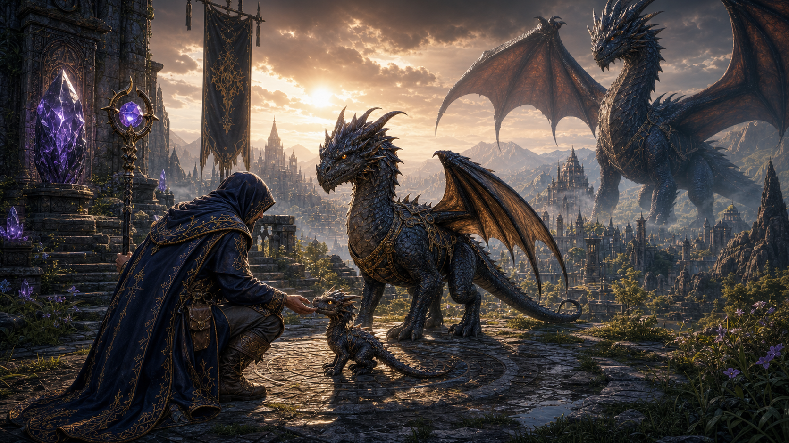

# RV16.9 - Mago Viajante e Dragoes

Data: 2026-06-23
Versao: `RV16.9 (v120)`
Status: implementado no `main`, sem deploy.

## Objetivo

Responder diretamente a referencia visual aprovada pelo maestro: o manto azul-escuro com bordados
dourados precisa existir no jogo como roupa rara conquistavel, e os dragoes precisam seguir a
mesma leitura de escala, proporcao e presenca.

## Entregas

### 1. Manto do Mago Viajante

- Novo item raro: `Manto do Mago Viajante`.
- Slot: `tronco`.
- Defesa: `9`.
- Raridade: conquistavel por quest, nao vendido em loja.
- Visual equipado:
  - capuz azul-profundo;
  - capa longa;
  - bordas douradas;
  - selo/orbe violeta;
  - ombreiras de pano;
  - cajado ritual visual nas costas.

### 2. Quest de conquista

NPC: Helyra.

Quest: `O Manto do Mago Viajante`.

Requisitos:
- concluir `O Terceiro Sinal`;
- nivel 10;
- entregar `Cristal do Pico`.

Recompensa:
- `Manto do Mago Viajante`;
- 260 XP.

Racional: a roupa representa um viajante que ja atravessou profecia, montanha e memoria da Veia.
Ela nao e cosmético solto; e trofeu de progresso.

### 3. Dragoes com proporcao mais premium

Alteracoes no modelo procedural:
- cor base menos infantil: ardósia/azul-escuro em vez de verde simples;
- corpo mais alongado;
- pescoco mais longo e nobre;
- cabeca/focinho reposicionados para leitura mais adulta;
- asas mais amplas;
- cauda mais longa;
- membranas mais escuras e coerentes com a arte;
- chifres maiores e leitura de silhueta mais forte.

### 4. Crescimento do dragao-companheiro

Escala dos estagios aumentada:
- filhote: `0.30 -> 0.36`;
- jovem: `0.62 -> 0.78`;
- adulto: `1.05 -> 1.22`.

Objetivo: o jogador precisa sentir a passagem de filhote para jovem e adulto como mudanca visual
real, nao apenas numero na ficha.

### 5. Arte oficial do patch

Arquivo: `public/patches/rv16-9-mago-viajante.png`.

Conectado em:
- `src/jogo/patchNotes.js`;
- `public/manifest.webmanifest`;
- `public/sw.js`;
- `public/baixar.html`;
- cache offline `venor-rv16-9-offline-v1`.

## Aceite

- A roupa existe como item real.
- A roupa tem caminho de conquista.
- A roupa aparece visualmente no personagem ao equipar.
- A arte do patch representa uma direcao que agora existe no jogo.
- Dragoes ficam maiores e mais proporcionais ao crescer.

## Proximo

Continuar com interiores/guildhouses e cidade jogavel usando as previas de `docs/PREVIAS_VISUAIS_RV16_9.md`.
